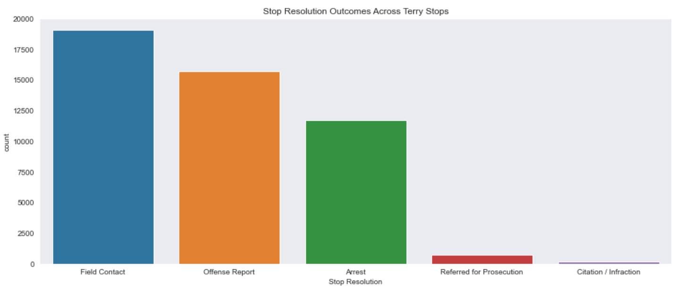

 
# Terry Stop Project

**Author**: Sierra Stanton

## Overview


This project analyses records of police reported stops as documented by the Seatlle Police Department for the Supreme Court case Terry v. Ohio.

In Terry v. Ohio (Links to an external site.), a landmark Supreme Court case in 1967-8, the court found that a police officer was not in violation of the "unreasonable search and seizure" clause of the Fourth Amendment, even though he stopped and frisked a couple of suspects only because their behavior was suspicious. Thus was born the notion of "reasonable suspicion", according to which an agent of the police may e.g. temporarily detain a person, even in the absence of clearer evidence that would be required for full-blown arrests etc. Terry Stops are stops made of suspicious drivers.

## Problem We're Tackling

Data.gov has released a public dataset representing Terry Stops in Seattle, Washington, and the various factors that might influence both the original stop and the outcome of said stop.

We'll build a classifier to help predict whether an arrest was made after a Terry Stop, given various factors like the presence of weapons, the subject's race and gender, and more.

This informative data can not only help us predict whether an arrest would be made based on certain perceived factors, but we'll be able to better evaluate the practice altogether and better understand how perception plays a role in police practices.

## Data

Data will be used from the following source:
* __[Data.gov's Seattle Terry Stop Data](https://catalog.data.gov/dataset/terry-stops)__

Data.gov's XYZ (`Terry_Stops.csv`): this dataset represents records of police reported stops under landmark case Terry v. Ohio, 392 U.S. 1 (1968). Each row represents a unique stop and contains perceived demographics of the subject, as reported by the officer making the stop and officer demographics as reported to the Seattle Police Department.

## Methods & Results

We extracted and cleaned Terry stop data in order to build increasingly effective predictors of whether an arrest would be made based on an officer’s perceived information. This included running multiple model iterations of both logistic regression and decision trees in order to fine tune these predictions. We also investigated the relevant stop data to develop interesting findings.

Due to the datasets used and their associations with the current public discourse, I think these models can be tweaked according to different contexts in order to find additional predictors of arrest and forms of treatment based on perception.

### Finding 1


### Finding 2


### Finding 3


### Finding 4



## Conclusions


## Next Steps


## For More Information

Please review my full analysis in the [Jupyter Notebook](./dsc-terry-traffic-stops-working-notebook.ipynb) or [presentation](./Terry_Stop_Analysis_Project.pdf).

For any additional questions, please contact **Sierra Stanton** & stanton.sierraerin@gmail.com

## Repository Structure

```
├── README.md
├── dsc-terry-traffic-stops-working-notebook.ipynb
├── Terry_Stop_Analysis_Project.pdf
└── images
```
