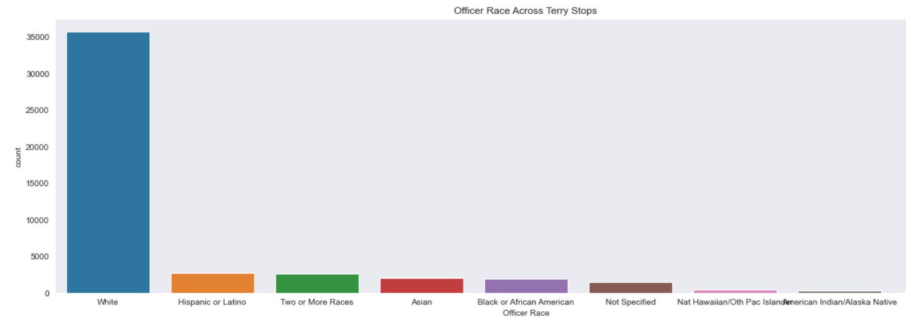
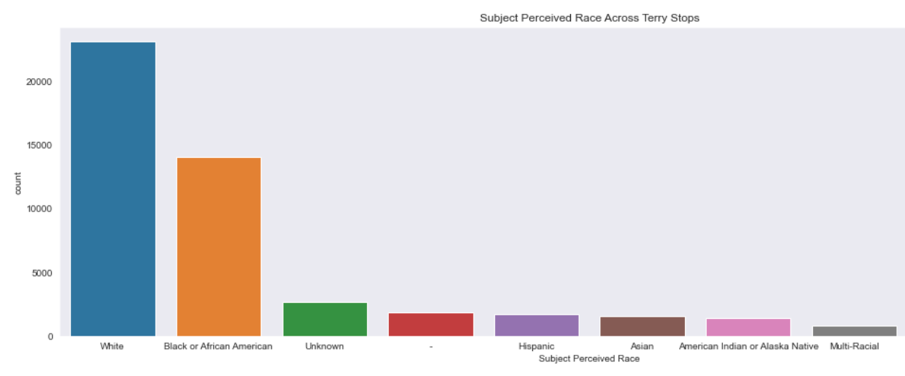
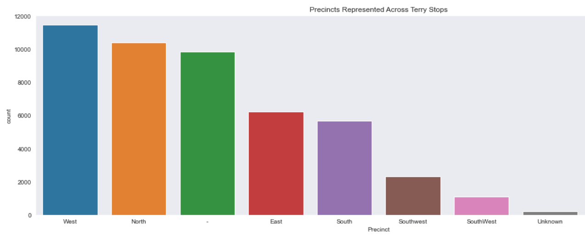

 
# Terry Stop Project

**Author**: Sierra Stanton

## Overview


This project analyses records of police reported stops as documented by the Seatlle Police Department for the Supreme Court case Terry v. Ohio.

In __[Terry v. Ohio](https://www.oyez.org/cases/1967/67)__, a landmark Supreme Court case in 1967-8, the court found that a police officer was not in violation of the "unreasonable search and seizure" clause of the Fourth Amendment, even though he stopped and frisked a couple of suspects only because their behavior was suspicious. Thus was born the notion of "reasonable suspicion", according to which an agent of the police may e.g. temporarily detain a person, even in the absence of clearer evidence that would be required for full-blown arrests etc. Terry Stops are stops made of suspicious drivers.

## Problem We're Tackling

Data.seattle.gov has released a public dataset representing Terry Stops in Seattle, Washington, and the various factors that might influence both the original stop and the outcome of said stop.

We'll build a classifier to help predict whether a life-altering outcome resulted after a Terry Stop, given various factors like the presence of weapons, the subject's race and gender, and more.

This informative data can not only help us predict whether a life-altering outcome would result based on certain perceived factors on part of the officer, but we'll also be better able to evaluate the practice altogether and better understand how perception plays a role in police practices.

## Data

Data will be used from the following source:
* __[Data.seattle.gov's Seattle Terry Stop Data](https://catalog.data.gov/dataset/terry-stops)__

Data.seattle.gov's Terry Stops Records (`Terry_Stops.csv`): this dataset represents 47,297 records of police reported stops under landmark case Terry v. Ohio, 392 U.S. 1 (1968). Each row represents a unique stop and contains perceived demographics of the subject, as reported by the officer making the stop and officer demographics as reported to the Seattle Police Department.

## Methods & Results

We extracted and cleaned Terry stop data in order to build increasingly effective predictors of whether a life-altering outcome would occur based on an officer’s perceived information. It's worth noting that the data set initially included additional factual data (i.e. Reported Date, Officer ID, and more), but we condensed the fields to focus primarily on subjective or perceived information on the part of the officer.

After cleaning and trimming our data to more acurately reflect those perceptions, or reasons why a driver might be deemed "suspicious", we created multiple models to accurately access this binary classification problem. This included running multiple model iterations of both logistic regression and decision trees in order to fine tune these predictions. We also investigated the relevant stop data to develop interesting findings.

Due to the datasets used and their associations with the current moment and public discourse, I think these models can be tweaked according to different contexts in order to find additional predictors of arrest and significant life-altering forms of treatment based on perception.

### Finding 1


### Finding 2


### Finding 3


### Finding 4


## Conclusions

Our study took an interesting take on Terry Stop data as we actually dwelled on primarily subjective data that tells us interesting stats when we compare our results and people affected to the normal census data of the city overall. We can see the skew in bias and perception when those affected are so drastically different and not reflective of city statistics, especially when it comes to who might be deemed "suspicious" or not and have a chance at receiving a life-altering outcome simply due to those perceptions.

We can see here with our logistic regression models we were able to increase the F1 score for our training data immensely (almost achieving a 1 with perfect precision and recall), however this didn't actually translate when we tried to use this same model on our testing data. We need to do more tweaking here in order to increase F1 without overfitting so this data is applicable to more use cases.

With our decision trees, we can see here that while further iteration resulted in more false positives and less false negatives - there's more work to do. Next, we can dive deeper into evaluation stats between our training and testing data and tweak our model further.

## Next Steps
We need to further iterate our models so they can be run against multiple data sets and current sources across cities. This could perhaps be developed to enable ranking amongst cities and even specific law enforcement precincts to show where perceptions, are in fact, unfair.

## For More Information

Please review my full analysis in the [Jupyter Notebook](./dsc-terry-traffic-stops-working-notebook.ipynb) or [presentation](./Terry_Stop_Analysis_Project.pdf).

For any additional questions, please contact **Sierra Stanton** & stanton.sierraerin@gmail.com

## Repository Structure

```
├── README.md
├── dsc-terry-traffic-stops-working-notebook.ipynb
├── Terry_Stop_Analysis_Project.pdf
├── data
└── images

```
